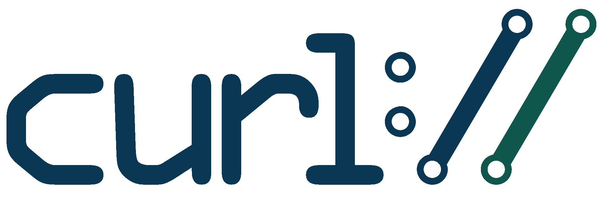

    

O **cURL** é uma ferramenta de linha de comando utilizada para **transferir dados entre um cliente e um servidor** por meio de diversos protocolos, incluindo **HTTP, HTTPS, FTP, FTPS, SCP, SFTP, LDAP**, entre outros.

No contexto de desenvolvimento e testes, o cURL é especialmente útil para **interagir com APIs, testar endpoints, enviar dados, realizar autenticação e analisar respostas HTTP diretamente pelo terminal**.

Ao longo deste material, utilizaremos o cURL para aprender, na prática, como realizar diferentes tipos de requisições HTTP.

---

    

Para os exemplos deste material, utilizaremos o **ServeRest**, uma API REST gratuita criada para **simular uma aplicação de loja virtual** e facilitar o aprendizado e a prática de **testes de APIs**.

O ServeRest disponibiliza endpoints para trabalhar com diferentes recursos, como:

* Usuários
* Produtos
* Carrinhos
* Autenticação

A documentação oficial pode ser acessada em [serverest.dev](https://serverest.dev/?utm_source=chatgpt.com).

### Repositório

O código-fonte do projeto está disponível no GitHub:

[GitHub — ServeRest](https://github.com/ServeRest/ServeRest?utm_source=chatgpt.com)

---

## Neste guia

Neste material, vamos explorar os principais recursos do **cURL** e aprender como utilizá-lo para realizar requisições e interagir com uma API REST.

### 1. Instalação

* [**Instalação do cURL**](./docs/install.md)

### 2. Requisições HTTP — CRUD

Nesta etapa, vamos aprender os principais métodos HTTP utilizados para realizar operações de **CRUD**:

* [**GET — Read**](./docs/get.md) — consultar dados
* [**POST — Create**](./docs/post.md) — criar recursos
* [**PUT — Update**](./docs/put.md) — atualizar recursos
* [**DELETE — Delete**](./docs/delete.md) — excluir recursos

### 3. Headers

* [**Adicionando Cabeçalhos (Headers)**](./docs/headers.md)

Aprenderemos como enviar informações adicionais nas requisições, como `Content-Type`, `Accept` e `Authorization`.

### 4. Login

* [**Login**](./docs/login.md)

Aprenderemos como realizar a autenticação de um usuário utilizando o endpoint de login do ServeRest.

### 5. Autenticação

* [**Autenticação**](./docs/auth.md)

Veremos como utilizar tokens de autenticação nas requisições por meio do header `Authorization`.

### 6. Upload de arquivos

* [**Enviando Arquivos com cURL**](./docs/file.md)

Aprenderemos como enviar arquivos utilizando `multipart/form-data` e o parâmetro `-F`.

### 7. Download de arquivos e respostas

* [**Salvando a Resposta em um Arquivo**](./docs/save.md)

Veremos como salvar o conteúdo retornado por uma API em um arquivo.

### 8. Redirecionamentos

* [**Seguindo Redirecionamentos**](./docs/redirect.md)

Aprenderemos como fazer o cURL seguir redirecionamentos HTTP automaticamente.

### 9. Headers da resposta

* [**Visualizando Cabeçalhos da Requisição e Resposta**](./docs/cabecalho.md)

Veremos como visualizar os headers retornados pelo servidor utilizando a opção `-i`.

### 10. Debugging

* [**Debugging com cURL**](./docs/debugging.md)

Aprenderemos como utilizar o modo `verbose` (`-v`) para analisar detalhadamente a comunicação entre o cURL e o servidor.

---

## Conclusão

O **cURL** é uma ferramenta simples, poderosa e muito útil para quem trabalha com **APIs, desenvolvimento e testes de software**.

Com ele, podemos realizar operações como:

* Fazer requisições HTTP.
* Criar, consultar, atualizar e excluir recursos.
* Enviar dados em JSON.
* Adicionar headers.
* Realizar autenticação.
* Enviar arquivos.
* Salvar respostas em arquivos.
* Visualizar headers HTTP.
* Investigar problemas utilizando o modo de debugging.

Este material apresenta os principais recursos necessários para começar a utilizar o cURL em testes e integrações com APIs.

O cURL possui muitos outros recursos, incluindo **cookies, proxies, certificados, diferentes métodos de autenticação, configuração de conexões e diversas opções avançadas**.

Para aprofundar seus conhecimentos, consulte a [documentação oficial do cURL](https://curl.se/docs/?utm_source=chatgpt.com).
