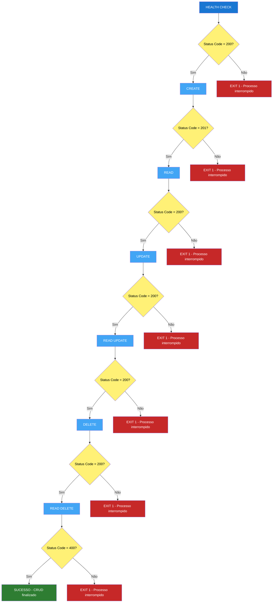

# CRUD Profissional

Abaixo está a versão completa com as duas camadas de validação:

- Health Check no início: se não retornar 200, o CRUD nem começa.
- Validação de cada operação: cada etapa verifica o Status Code esperado e interrompe o processo em caso de falha.
- No final, o GET após o DELETE espera 400, confirmando que o usuário foi excluído.

```bash
#!/bin/bash

BASE_URL="https://serverest.dev"
EMAIL="horadoqa_$(date +%s)@example.com"
PASSWORD="1q2w3e4r"

echo "======================================"
echo " CRUD DE USUÁRIOS - SERVEREST"
echo "======================================"

# ======================================
# HEALTH CHECK
# ======================================

echo ""
echo "0. HEALTH CHECK - Validando aplicação..."

HEALTH_STATUS=$(curl -s -o /dev/null -w "%{http_code}" \
    -X GET "$BASE_URL/usuarios")

if [ "$HEALTH_STATUS" -eq 200 ]; then
    echo "✅ Aplicação disponível - Status Code: $HEALTH_STATUS"
    echo "➡️ Iniciando fluxo CRUD..."
else
    echo "❌ Aplicação indisponível - Status Code: $HEALTH_STATUS"
    echo "⛔ Processo interrompido!"
    exit 1
fi

# ======================================
# CREATE - Criar usuário
# ======================================

echo ""
echo "1. CREATE - Criando usuário..."

CREATE_RESPONSE=$(curl -s -w "\n%{http_code}" \
    -X POST "$BASE_URL/usuarios" \
    -H "Content-Type: application/json" \
    -d "{
        \"nome\": \"Hora do QA\",
        \"email\": \"$EMAIL\",
        \"password\": \"$PASSWORD\",
        \"administrador\": \"false\"
    }")

CREATE_STATUS=$(echo "$CREATE_RESPONSE" | tail -n 1)
CREATE_BODY=$(echo "$CREATE_RESPONSE" | sed '$d')

echo "$CREATE_BODY" | jq .

if [ "$CREATE_STATUS" -eq 201 ]; then
    echo "✅ CREATE aprovado - Status Code: $CREATE_STATUS"
else
    echo "❌ CREATE reprovado - Status Code: $CREATE_STATUS"
    echo "⛔ Processo interrompido!"
    exit 1
fi

USER_ID=$(echo "$CREATE_BODY" | jq -r '._id')

if [ -z "$USER_ID" ] || [ "$USER_ID" = "null" ]; then
    echo "❌ Não foi possível obter o ID do usuário."
    echo "⛔ Processo interrompido!"
    exit 1
fi

echo "👤 Usuário criado com ID: $USER_ID"

# ======================================
# READ - Consultar usuário
# ======================================

echo ""
echo "2. READ - Consultando usuário..."

READ_RESPONSE=$(curl -s -w "\n%{http_code}" \
    -X GET "$BASE_URL/usuarios/$USER_ID" \
    -H "Accept: application/json")

READ_STATUS=$(echo "$READ_RESPONSE" | tail -n 1)
READ_BODY=$(echo "$READ_RESPONSE" | sed '$d')

echo "$READ_BODY" | jq .

if [ "$READ_STATUS" -eq 200 ]; then
    echo "✅ READ aprovado - Status Code: $READ_STATUS"
else
    echo "❌ READ reprovado - Status Code: $READ_STATUS"
    echo "⛔ Processo interrompido!"
    exit 1
fi

# ======================================
# UPDATE - Atualizar usuário
# ======================================

echo ""
echo "3. UPDATE - Atualizando usuário..."

UPDATE_RESPONSE=$(curl -s -w "\n%{http_code}" \
    -X PUT "$BASE_URL/usuarios/$USER_ID" \
    -H "Content-Type: application/json" \
    -d "{
        \"nome\": \"Hora do QA - Atualizado\",
        \"email\": \"$EMAIL\",
        \"password\": \"$PASSWORD\",
        \"administrador\": \"true\"
    }")

UPDATE_STATUS=$(echo "$UPDATE_RESPONSE" | tail -n 1)
UPDATE_BODY=$(echo "$UPDATE_RESPONSE" | sed '$d')

echo "$UPDATE_BODY" | jq .

if [ "$UPDATE_STATUS" -eq 200 ]; then
    echo "✅ UPDATE aprovado - Status Code: $UPDATE_STATUS"
else
    echo "❌ UPDATE reprovado - Status Code: $UPDATE_STATUS"
    echo "⛔ Processo interrompido!"
    exit 1
fi

# ======================================
# READ - Consultar usuário atualizado
# ======================================

echo ""
echo "4. READ - Consultando usuário atualizado..."

READ_UPDATE_RESPONSE=$(curl -s -w "\n%{http_code}" \
    -X GET "$BASE_URL/usuarios/$USER_ID" \
    -H "Accept: application/json")

READ_UPDATE_STATUS=$(echo "$READ_UPDATE_RESPONSE" | tail -n 1)
READ_UPDATE_BODY=$(echo "$READ_UPDATE_RESPONSE" | sed '$d')

echo "$READ_UPDATE_BODY" | jq .

if [ "$READ_UPDATE_STATUS" -eq 200 ]; then
    echo "✅ READ após UPDATE aprovado - Status Code: $READ_UPDATE_STATUS"
else
    echo "❌ READ após UPDATE reprovado - Status Code: $READ_UPDATE_STATUS"
    echo "⛔ Processo interrompido!"
    exit 1
fi

# ======================================
# DELETE - Excluir usuário
# ======================================

echo ""
echo "5. DELETE - Excluindo usuário..."

DELETE_RESPONSE=$(curl -s -w "\n%{http_code}" \
    -X DELETE "$BASE_URL/usuarios/$USER_ID")

DELETE_STATUS=$(echo "$DELETE_RESPONSE" | tail -n 1)
DELETE_BODY=$(echo "$DELETE_RESPONSE" | sed '$d')

echo "$DELETE_BODY" | jq .

if [ "$DELETE_STATUS" -eq 200 ]; then
    echo "✅ DELETE aprovado - Status Code: $DELETE_STATUS"
else
    echo "❌ DELETE reprovado - Status Code: $DELETE_STATUS"
    echo "⛔ Processo interrompido!"
    exit 1
fi

# ======================================
# READ - Validar exclusão
# ======================================

echo ""
echo "6. READ - Validando exclusão..."

DELETE_CHECK_RESPONSE=$(curl -s -w "\n%{http_code}" \
    -X GET "$BASE_URL/usuarios/$USER_ID" \
    -H "Accept: application/json")

DELETE_CHECK_STATUS=$(echo "$DELETE_CHECK_RESPONSE" | tail -n 1)
DELETE_CHECK_BODY=$(echo "$DELETE_CHECK_RESPONSE" | sed '$d')

echo "$DELETE_CHECK_BODY" | jq .

if [ "$DELETE_CHECK_STATUS" -eq 400 ]; then
    echo "✅ Exclusão confirmada - Status Code: $DELETE_CHECK_STATUS"
else
    echo "❌ Validação da exclusão reprovada - Status Code: $DELETE_CHECK_STATUS"
    echo "⛔ Processo interrompido!"
    exit 1
fi

# ======================================
# FINAL
# ======================================

echo ""
echo "======================================"
echo " ✅ CRUD FINALIZADO COM SUCESSO"
echo "======================================"

```


