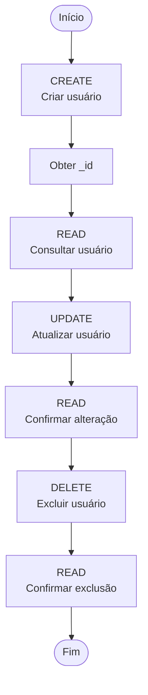

# CRUD de usuários no ServeRest

Realiza o fluxo

```bash
#!/bin/bash

BASE_URL="https://serverest.dev"
EMAIL="horadoqa_$(date +%s)@example.com"
PASSWORD="1q2w3e4r"

echo "======================================"
echo " CRUD DE USUÁRIOS - SERVEREST"
echo "======================================"

# ======================================
# HEALTH CHECK - Verificar disponibilidade
# ======================================

echo ""
echo "0. HEALTH CHECK - Verificando disponibilidade do ServeRest..."

STATUS_CODE=$(curl -s -o /dev/null -w "%{http_code}" "$BASE_URL/usuarios")

if [ "$STATUS_CODE" -eq 200 ]; then
    echo "✓ ServeRest está disponível."
    echo "  Status Code: $STATUS_CODE"
else
    echo "✗ ServeRest não está respondendo corretamente."
    echo "  Status Code: $STATUS_CODE"
    echo ""
    echo "CRUD interrompido."
    exit 1
fi

# ======================================
# CREATE - Criar usuário
# ======================================

echo ""
echo "1. CREATE - Criando usuário..."

CREATE_RESPONSE=$(curl -s -X POST "$BASE_URL/usuarios" \
  -H "Content-Type: application/json" \
  -d "{
    \"nome\": \"Hora do QA\",
    \"email\": \"$EMAIL\",
    \"password\": \"$PASSWORD\",
    \"administrador\": \"false\"
  }")

echo "$CREATE_RESPONSE" | jq .

# Obtém o ID do usuário criado
USER_ID=$(echo "$CREATE_RESPONSE" | jq -r '._id')

echo ""
echo "Usuário criado com ID: $USER_ID"

# ======================================
# READ - Consultar usuário
# ======================================

echo ""
echo "2. READ - Consultando usuário..."

READ_RESPONSE=$(curl -s -X GET "$BASE_URL/usuarios/$USER_ID" \
  -H "Accept: application/json")

echo "$READ_RESPONSE" | jq .

# ======================================
# UPDATE - Atualizar usuário
# ======================================

echo ""
echo "3. UPDATE - Atualizando usuário..."

UPDATE_RESPONSE=$(curl -s -X PUT "$BASE_URL/usuarios/$USER_ID" \
  -H "Content-Type: application/json" \
  -d "{
    \"nome\": \"Hora do QA - Atualizado\",
    \"email\": \"$EMAIL\",
    \"password\": \"$PASSWORD\",
    \"administrador\": \"true\"
  }")

echo "$UPDATE_RESPONSE" | jq .

# ======================================
# READ - Consultar usuário atualizado
# ======================================

echo ""
echo "4. READ - Consultando usuário atualizado..."

READ_UPDATE_RESPONSE=$(curl -s -X GET "$BASE_URL/usuarios/$USER_ID" \
  -H "Accept: application/json")

echo "$READ_UPDATE_RESPONSE" | jq .

# ======================================
# DELETE - Excluir usuário
# ======================================

echo ""
echo "5. DELETE - Excluindo usuário..."

DELETE_RESPONSE=$(curl -s -X DELETE "$BASE_URL/usuarios/$USER_ID")

echo "$DELETE_RESPONSE" | jq .

# ======================================
# READ - Validar exclusão
# ======================================

echo ""
echo "6. READ - Validando exclusão..."

DELETE_CHECK=$(curl -s -X GET "$BASE_URL/usuarios/$USER_ID" \
  -H "Accept: application/json")

echo "$DELETE_CHECK" | jq .

echo ""
echo "======================================"
echo " CRUD FINALIZADO"
echo "======================================"
```

```

### Como executar

Salve o arquivo, por exemplo, como:

```bash
crud_serverest.sh
```

Dê permissão de execução:

```bash
chmod +x crud_serverest.sh
```

E execute:

```bash
./crud_serverest.sh
```

### Dependência

O script utiliza o **`jq`** para formatar o JSON e extrair o `_id` retornado pelo ServeRest.

Verifique se ele está instalado:

```bash
jq --version
```

No Ubuntu/Debian:

```bash
sudo apt install jq
```

### O fluxo do script

Ele executa exatamente o ciclo CRUD:



Uma vantagem desse exemplo para o seu material de **cURL + ServeRest** é que ele demonstra algo mais próximo de um teste de API real: o resultado do **POST** é utilizado pelo script para obter o `_id`, e esse `_id` é utilizado nas requisições seguintes.

