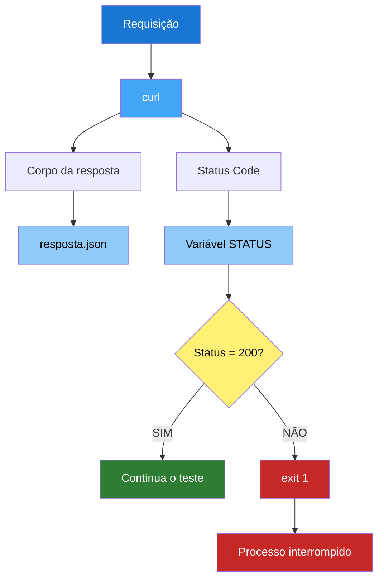
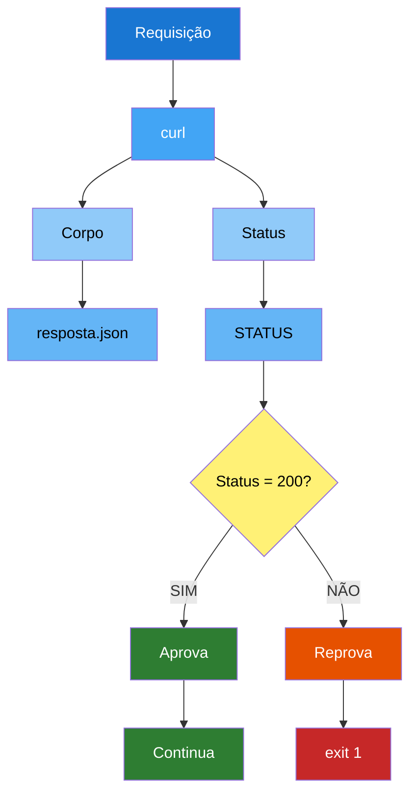
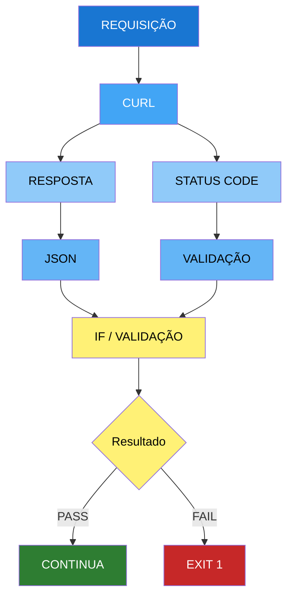

# `curl`: Salvando Respostas, Validando Status Code e Baixando Arquivos

Durante testes de API, frequentemente precisamos **armazenar a resposta de uma requisição**, **analisar seu conteúdo**, **validar o Status Code** e, em alguns casos, **baixar arquivos disponibilizados por uma aplicação**.

O `curl` possui opções que facilitam todas essas tarefas.

---

# 1. Salvando a resposta em um arquivo

Para salvar a resposta de uma requisição em um arquivo, utilizamos a opção:

```bash
-o
```

ou sua forma completa:

```bash
--output
```

### Exemplo

```bash
curl -o resposta.json https://serverest.dev/usuarios
```

Nesse comando:

* `-o` → define o arquivo de saída;
* `resposta.json` → nome do arquivo que será criado;
* `https://serverest.dev/usuarios` → endpoint que será chamado.

Após a execução, a resposta da API será armazenada em:

```text
resposta.json
```

Isso é bastante útil em testes de API porque podemos **guardar a resposta para análise posterior ou utilizá-la em outras etapas do teste**.

---

# 2. Visualizando a resposta salva

Depois de salvar a resposta, podemos utilizar o `cat` para visualizar o conteúdo:

```bash
cat resposta.json
```

Quando a API retorna JSON, podemos utilizar o `jq`, que apresenta o conteúdo de forma mais organizada:

```bash
jq . resposta.json
```

Também é possível utilizar:

```bash
cat resposta.json | jq .
```

Porém, quando estamos trabalhando diretamente com um arquivo, a primeira opção é mais simples:

```bash
jq . resposta.json
```

---

# 3. Salvando a resposta de um POST

A opção `-o` pode ser utilizada em qualquer método HTTP, incluindo `POST`.

Por exemplo, podemos criar um usuário na API ServeRest e salvar a resposta:

```bash
curl -X POST "https://serverest.dev/usuarios" \
  -H "Content-Type: application/json" \
  -d '{
    "nome": "Hora do QA",
    "email": "horadoqa@example.com",
    "password": "1q2w3e4r",
    "administrador": "false"
  }' \
  -o resposta.json
```

A resposta da API será armazenada em:

```text
resposta.json
```

Podemos então visualizar o resultado:

```bash
jq . resposta.json
```

Por exemplo, a API pode retornar informações como o ID do usuário criado.

---

# 4. `-o` x `-O`

É importante não confundir as opções `-o` e `-O`.

## `-o` — definir o nome do arquivo

Com `-o`, nós escolhemos o nome do arquivo:

```bash
curl -o resposta.json https://serverest.dev/usuarios
```

O resultado será salvo como:

```text
resposta.json
```

Outro exemplo:

```bash
curl -o meu-relatorio.pdf https://exemplo.com/relatorio.pdf
```

O arquivo será salvo como:

```text
meu-relatorio.pdf
```

---

## `-O` — utilizar o nome da URL

Com `-O`, o `curl` utiliza o nome do arquivo informado na própria URL.

```bash
curl -O https://exemplo.com/relatorio.pdf
```

Nesse caso, o arquivo será salvo como:

```text
relatorio.pdf
```

### Resumindo

| Opção        | Comportamento                    |
| ------------ | -------------------------------- |
| `-o arquivo` | Define o nome do arquivo         |
| `-O`         | Utiliza o nome do arquivo da URL |

Uma forma simples de memorizar:

```text
-o → eu escolho o nome
-O → a URL define o nome
```

---

# 5. Salvando a resposta e capturando o Status Code

Em testes de API, muitas vezes não basta salvar o corpo da resposta.

Também precisamos saber se a requisição foi processada corretamente.

Para isso, podemos utilizar:

```bash
-w
```

ou:

```bash
--write-out
```

A variável `%{http_code}` permite obter o Status Code HTTP retornado pela API.

### Exemplo

```bash
curl -s \
  -o resposta.json \
  -w "%{http_code}" \
  https://serverest.dev/usuarios
```

Nesse exemplo temos três elementos importantes:

```text
-s
```

Executa o `curl` em modo silencioso, evitando informações desnecessárias no terminal.

```text
-o resposta.json
```

Salva o corpo da resposta no arquivo `resposta.json`.

```text
-w "%{http_code}"
```

Exibe o Status Code HTTP retornado pela API.

Se a requisição for bem-sucedida, podemos obter:

```text
200
```

Enquanto o corpo da resposta estará armazenado em:

```text
resposta.json
```

---

# 6. Armazenando o Status Code em uma variável

Em um teste automatizado, podemos armazenar o Status Code em uma variável:

```bash
STATUS=$(curl -s \
  -o resposta.json \
  -w "%{http_code}" \
  https://serverest.dev/usuarios)
```

Agora podemos utilizar a variável:

```bash
echo "$STATUS"
```

Se a API retornar HTTP 200:

```text
200
```

Podemos também analisar o corpo da resposta:

```bash
jq . resposta.json
```

Dessa forma, temos duas informações separadas:

```text
STATUS
  ↓
200

resposta.json
  ↓
Corpo da resposta da API
```

Essa separação é muito útil em automação de testes.

---

# 7. Validando o Status Code com `if`

Agora podemos utilizar o Status Code para decidir se o teste deve continuar ou ser interrompido.

```bash
STATUS=$(curl -s \
  -o resposta.json \
  -w "%{http_code}" \
  https://serverest.dev/usuarios)

if [ "$STATUS" -eq 200 ]; then
    echo "✅ API disponível - Status Code: $STATUS"
    jq . resposta.json
else
    echo "❌ API indisponível - Status Code: $STATUS"
    jq . resposta.json
    exit 1
fi
```

Nesse exemplo, a regra é:

```text
Status Code = 200
       ↓
    Continua
```

Caso contrário:

```text
Status Code ≠ 200
       ↓
    exit 1
       ↓
Processo interrompido
```

O `exit 1` é especialmente importante em automação porque informa ao sistema operacional e a ferramentas como **GitHub Actions** que o processo terminou com erro.

---

# 8. Fluxo de uma validação automatizada

Podemos representar esse processo da seguinte maneira:



Essa estrutura pode ser aplicada em scripts de teste de API para criar um fluxo de **passou → continua / falhou → interrompe**.

---

# 9. Baixando arquivos com `curl`

Além de trabalhar com respostas de APIs, o `curl` também pode ser utilizado para **baixar arquivos**.

### Utilizando `-O`

```bash
curl -O https://exemplo.com/arquivo.zip
```

Nesse caso, o `curl` utiliza o nome do arquivo informado na URL.

O resultado será:

```text
arquivo.zip
```

Outro exemplo:

```bash
curl -O https://exemplo.com/relatorio.pdf
```

Resultado:

```text
relatorio.pdf
```

---

# 10. Baixando um arquivo com nome personalizado

Podemos utilizar `-o` para escolher o nome do arquivo:

```bash
curl -o meu-relatorio.pdf https://exemplo.com/relatorio.pdf
```

O arquivo será salvo como:

```text
meu-relatorio.pdf
```

Portanto:

```text
-O → utiliza o nome da URL

-o → você define o nome
```

---

# 11. Baixando um arquivo para uma pasta

Também podemos especificar o caminho completo:

```bash
curl -o ./downloads/relatorio.pdf \
  https://exemplo.com/relatorio.pdf
```

Nesse caso, o arquivo será salvo em:

```text
downloads/relatorio.pdf
```

A pasta `downloads` precisa existir previamente.

Podemos criá-la com:

```bash
mkdir -p downloads
```

E então executar:

```bash
curl -o ./downloads/relatorio.pdf \
  https://exemplo.com/relatorio.pdf
```

---

# 12. Continuando um download interrompido

Se um download for interrompido, podemos tentar continuar a partir do ponto em que parou utilizando:

```bash
curl -C - -O https://exemplo.com/arquivo.zip
```

A opção:

```text
-C -
```

instrui o `curl` a continuar o download a partir do ponto disponível.

Essa funcionalidade é especialmente útil para arquivos grandes ou quando a conexão pode sofrer interrupções.

---

# 13. Exemplo completo para testes de API

Podemos combinar essas funcionalidades em um pequeno teste automatizado:

```bash
#!/bin/bash

URL="https://serverest.dev/usuarios"
ARQUIVO="resposta.json"

echo "Consultando API..."

STATUS=$(curl -s \
  -o "$ARQUIVO" \
  -w "%{http_code}" \
  "$URL")

echo "Status Code: $STATUS"

if [ "$STATUS" -eq 200 ]; then
    echo "✅ Teste aprovado"
    echo ""
    echo "Resposta da API:"
    jq . "$ARQUIVO"
else
    echo "❌ Teste reprovado"
    echo ""
    echo "Resposta da API:"
    jq . "$ARQUIVO"

    exit 1
fi
```

O fluxo desse teste é:



---

# 14. Principais opções utilizadas

| Opção          | Função                                           |
| -------------- | ------------------------------------------------ |
| `-X`           | Define o método HTTP                             |
| `-H`           | Adiciona um Header                               |
| `-d`           | Envia dados no corpo da requisição               |
| `-o`           | Salva a resposta em um arquivo com nome definido |
| `-O`           | Salva utilizando o nome do arquivo da URL        |
| `-s`           | Executa em modo silencioso                       |
| `-w`           | Permite formatar informações da resposta         |
| `%{http_code}` | Obtém o Status Code HTTP                         |
| `-C -`         | Continua um download interrompido                |

---

# Conclusão

O `curl` vai muito além de simplesmente fazer uma requisição HTTP.

Em automação de testes, podemos utilizá-lo para:

* realizar requisições HTTP;
* enviar Headers e payloads;
* salvar respostas em arquivos;
* analisar JSON com `jq`;
* capturar Status Codes;
* validar condições com `if`;
* interromper testes com `exit 1`;
* baixar arquivos;
* continuar downloads interrompidos;
* gerar evidências para análise dos testes.

Uma estrutura bastante útil para automação de QA é:



Esse padrão forma uma boa base para evoluir de comandos `curl` isolados para **scripts de automação de testes de API**, como o CRUD do ServeRest.
